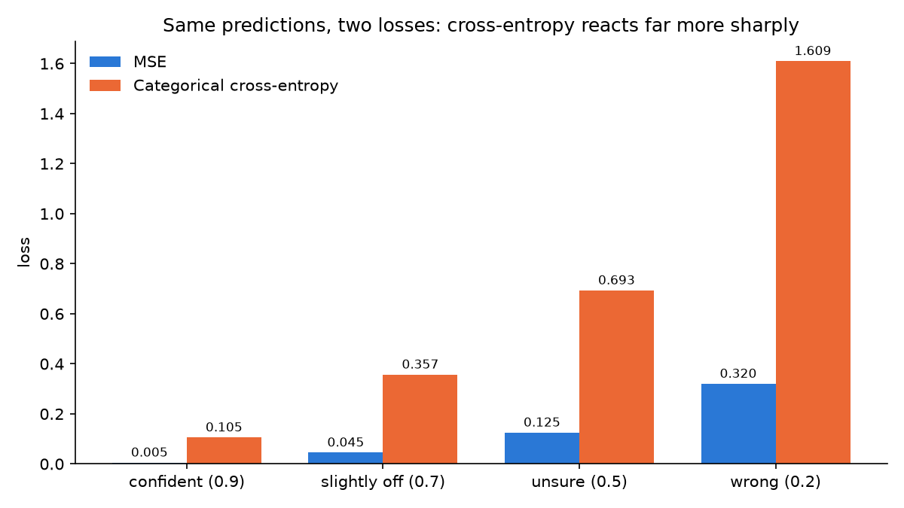
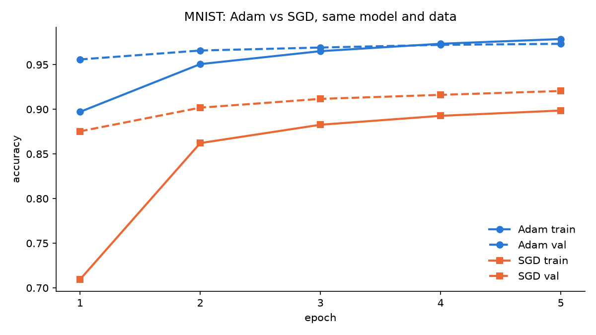
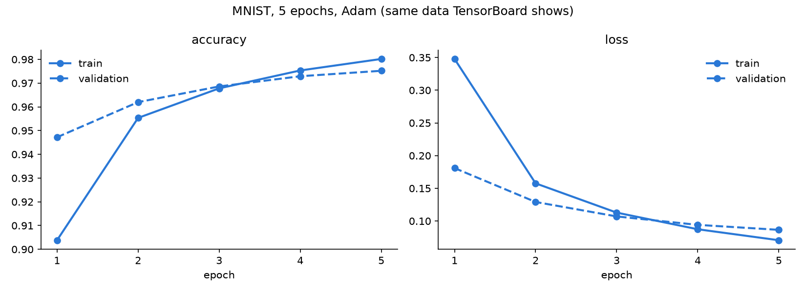
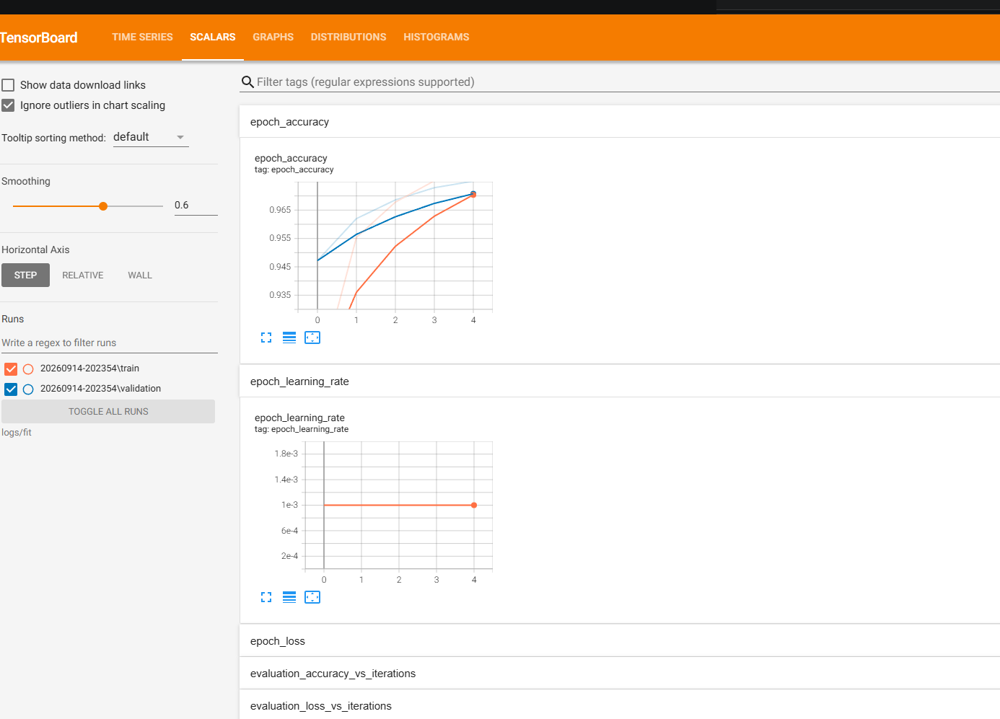
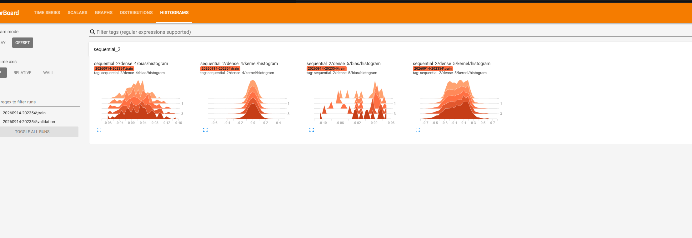

# CS5720 Neural Networks and Deep Learning — Home Assignment 1

**Student:** Jeff Agnitsch
**Student ID:** 7005146960
**Course:** CS5720, Fall 2026, University of Central Missouri

## Summary

Four short TensorFlow exercises in one notebook, [CS5720_HA1_Agnitsch.ipynb](CS5720_HA1_Agnitsch.ipynb):
tensor reshaping and broadcasting, comparing MSE and categorical cross-entropy, training MNIST
with Adam vs SGD, and logging an MNIST run to TensorBoard. The working plan and concept notes
are in [ROADMAP.md](ROADMAP.md). Everything runs on CPU (TensorFlow 2.21, Python 3.13) in a
few minutes.

## How to run

```powershell
py -3 -m venv .venv
.\.venv\Scripts\Activate.ps1
pip install -r requirements.txt
jupyter notebook CS5720_HA1_Agnitsch.ipynb
```

Run all cells top to bottom. Charts are written to `images/` and TensorBoard logs to `logs/fit/`.
To open TensorBoard after Task 4 has run:

```powershell
tensorboard --logdir logs/fit
```

then browse to http://localhost:6006 and open the **Scalars** tab.

## Task 1 — Tensor manipulation and reshaping

| step | rank | shape |
|---|---|---|
| random tensor | 2 | (4, 6) |
| `tf.reshape` | 3 | (2, 3, 4) |
| `tf.transpose(perm=[1, 0, 2])` | 3 | (3, 2, 4) |
| small tensor | 2 | (1, 4) |
| broadcast sum | 3 | (3, 2, 4) |

Reshape is legal because 4 × 6 = 24 = 2 × 3 × 4; it regroups the same elements without moving
them. Transpose swaps axes 0 and 1 and does move data.

**How broadcasting works.** TensorFlow compares the two shapes from the rightmost axis leftward.
A shape with fewer axes is padded on the left with 1s. Two axes are compatible when they are
equal or one of them is 1, and every size-1 axis is treated as if it were repeated to match the
other tensor, without making a copy. So `(1, 4)` against `(3, 2, 4)` becomes `(1, 1, 4)`, then
1→3, 1→2, 4=4, giving `(3, 2, 4)`. The same `(1, 4)` tensor cannot be added to the original
`(4, 6)` because the last axes are 4 and 6; the notebook shows that error on purpose.

## Task 2 — Loss functions

`y_true` is two one-hot rows over three classes. Each prediction variant puts a chosen
probability on the correct class and splits the rest evenly, so every row is a valid softmax
output.

| prediction | MSE | categorical cross-entropy |
|---|---|---|
| confident (0.9) | 0.0050 | 0.1054 |
| slightly off (0.7) | 0.0450 | 0.3567 |
| unsure (0.5) | 0.1250 | 0.6931 |
| wrong (0.2) | 0.3200 | 1.6094 |



Both losses rise as the correct-class probability falls, but not at the same rate. MSE is bounded
(a squared difference of probabilities) so it grows gently. Cross-entropy is −log(p_correct), so
it grows without bound as the model becomes confidently wrong. That steep gradient exactly when
the model is most wrong is why classifiers train with cross-entropy rather than MSE.

## Task 3 — Adam vs SGD on MNIST

Same model both times: `Flatten → Dense(128, relu) → Dense(10, softmax)`, seeded so the initial
weights are identical, 5 epochs, batch 128, 10% of the training set held out for validation.
Only the optimizer changes: Adam at its default learning rate 0.001, SGD at its default 0.01.

| optimizer | val acc, epoch 1 | val acc, epoch 5 |
|---|---|---|
| Adam | 95.6% | 97.3% |
| SGD | 87.5% | 92.1% |



Adam converges much faster and SGD is still climbing at epoch 5. SGD uses one fixed step size for
every weight; Adam keeps running gradient statistics per weight and scales each step individually,
so it moves quickly on flat directions and carefully on steep ones with no tuning. This compares
out-of-the-box defaults; SGD with a larger learning rate or momentum would narrow the gap.

## Task 4 — TensorBoard

The same model is trained for 5 epochs with Adam and a `TensorBoard` callback writing to a
timestamped folder under `logs/fit/`, using the 10 000-image test set as validation data.

| epoch | train acc | val acc | train loss | val loss |
|---|---|---|---|---|
| 1 | 0.9038 | 0.9472 | 0.3478 | 0.1809 |
| 2 | 0.9553 | 0.9620 | 0.1576 | 0.1291 |
| 3 | 0.9678 | 0.9686 | 0.1129 | 0.1070 |
| 4 | 0.9753 | 0.9729 | 0.0874 | 0.0941 |
| 5 | 0.9802 | 0.9752 | 0.0706 | 0.0865 |



TensorBoard Scalars view of the same run (orange = train, blue = validation). TensorBoard's
default smoothing of 0.6 is on, so the bold lines are smoothed and the faint lines behind them are
the raw per-epoch values from the table above. The `epoch_learning_rate` panel confirms Adam's
learning rate stayed at its default 0.001 throughout.



The Histograms tab shows the weight and bias distributions of both Dense layers at each epoch,
stacked front to back. They stay centred and roughly the same width across the five epochs, which
is consistent with the loss curves: the network is still learning, not memorising.



### 4.1 Answers

**1. What patterns do you observe in the training and validation accuracy curves?**
Both curves rise every epoch and flatten as they approach 98%. Training accuracy goes from 90.4%
to 98.0%, validation from 94.7% to 97.5%. For the first three epochs validation accuracy is above
training accuracy. That is expected: the training figure is averaged over the whole epoch while the
weights are still improving, whereas validation is measured once at the end of the epoch with the
finished weights. By epoch 4 the lines cross and a small gap opens with training ahead.

**2. How can you use TensorBoard to detect overfitting?**
In the Scalars tab, overlay the train and validation `epoch_loss` curves. Overfitting appears as a
divergence: training loss keeps dropping while validation loss flattens and then rises, and
training accuracy keeps climbing while validation accuracy stalls. The widening gap is the signal,
and the epoch where validation loss bottoms out is where training should have stopped. The
Histograms tab is a secondary check: weights that keep growing epoch after epoch often go with
memorisation. In this 5-epoch run the two loss curves are still converging, so the model is not
overfitting yet.

**3. What happens when you increase the number of epochs?**
Training loss keeps falling toward zero and training accuracy toward 100%, because the network can
eventually memorise the training set. Validation accuracy plateaus near 98% and validation loss
reaches a minimum and then creeps upward as the model starts fitting noise. Extra epochs help until
the validation curve turns, then hurt. The fixes are early stopping, regularisation such as dropout,
or more data. The small gap already visible at epoch 5 is the start of that trend.

## Video

_TODO: link on Brightspace._
